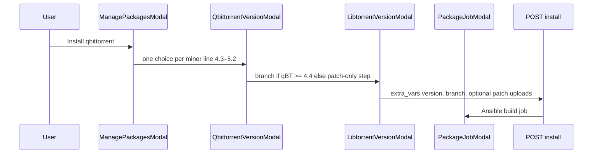
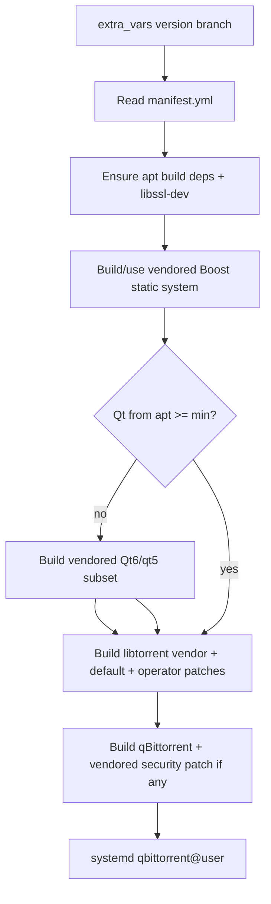

# qBittorrent compile install with vendored deps

## Current state

- Catalog entry exists in [`internal/packages/catalog/catalog.go`](internal/packages/catalog/catalog.go) but playbooks are stubs ([`ansible/playbooks/packages/qbittorrent/install.yml`](ansible/playbooks/packages/qbittorrent/install.yml)).
- Install flow is `select` → optional `secrets` → `job` ([`web/src/components/app-shell.tsx`](web/src/components/app-shell.tsx)); only autobrr uses secrets.
- Detection expects `qbittorrent.service` (system-wide); swizzin/brrewery pattern for user apps is `package@{user}.service` (see autobrr in [`ansible/playbooks/packages/autobrr/install.yml`](ansible/playbooks/packages/autobrr/install.yml)).

## Target UX (install only, compiled versions)



- **No** distro "Repo" option (per your choice).
- **Libtorrent branch modal** only when selected qBittorrent ≥ 4.4 (`RC_1_2` vs `RC_2_0`); 4.3 always uses `RC_1_2` implicitly.
- **Libtorrent patch (Web UI):** optional `.patch` file upload on the libtorrent step (branch modal when ≥ 4.4, or a dedicated patch-only step after version select for 4.3). Skip upload → brrewery applies the **vendored** default performance patch for the selected branch.
- Same wizard on **upgrade** when qBittorrent is in the queue (reuse `extra_vars` path already supported by upgrade handler).

## Version selection policy

**One qBittorrent release per major.minor line** — only the **latest stable patch** for each line (e.g. `4.3.9`, not `4.3.0` / `4.3.2`). The UI shows minor lines (`4.3`, `4.4`, … `5.2`); `extra_vars.qbittorrent_version` carries the full pinned semver from the manifest.

Supported minor lines: **4.3, 4.4, 4.5, 4.6, 5.0, 5.1, 5.2** (exact patch versions resolved at manifest/vendor refresh time).

Validator rejects any semver not exactly equal to a manifest entry (no arbitrary patch input).

### Dependency pinning rule

**Always use the latest supported libtorrent, Boost, Qt, and zlib versions for each qBittorrent minor-line build** — not minimum/floor versions and not older tags that merely satisfy upstream's stated minimum.

- **libtorrent:** For the selected branch (`RC_1_2` or `RC_2_0`), pin the **newest release tag** that remains compatible with that qBittorrent line (e.g. latest `v1.2.*` or `v2.0.*`), refreshed when vendoring.
- **Boost / Qt / zlib:** Per minor line, pin the **newest vendored bundle** that meets or exceeds that line's build profile minimum (Qt: latest qtbase+qttools bundle ≥ `qt_min`; Boost: current swizzin-style static `system` tree; zlib: latest compatible with the Qt bundle).
- **User choice is only** qBittorrent minor line + libtorrent branch (1.2 vs 2.0 where allowed); dependency versions are **not** exposed in the UI.
- **Maintainer refreshes:** When updating `manifest.yml` or running `vendor-qbittorrent-deps.sh`, bump dependency pins to latest compatible versions alongside the latest qBittorrent patch for that line.

## Version matrix (encode in manifest + Go validator)

Build profile is keyed by **major.minor**; swizzin's per-patch splits (e.g. 4.3.0–4.3.2 vs 4.3.3+) are **not** used — the profile for `4.3` matches whatever the latest vendored 4.3.x release requires:

| Minor line | Example pinned patch (manifest) | libtorrent branches | libtorrent pin | C++ std | Qt min | Build system |
| ---------- | ------------------------------- | ------------------- | -------------- | ------- | ------ | ------------ |
| 4.3 | latest 4.3.x only | RC_1_2 only | latest v1.2.x | c++17 | 5.12 | autotools |
| 4.4 | latest 4.4.x | RC_1_2 or RC_2_0 | v1.2.14 / v2.0.x | c++17 | 6.0 | cmake + Qt6 |
| 4.5 | latest 4.5.x | RC_1_2 or RC_2_0 | v1.2.18 / v2.0.x | c++17 | 6.2 | cmake |
| 4.6 | latest 4.6.x | RC_1_2 or RC_2_0 | v1.2.19 / v2.0.x | c++17 | 6.4 | cmake |
| 5.0 | latest 5.0.x | RC_1_2 or RC_2_0 | v1.2.19 / v2.0.x | c++20 | 6.5 | cmake |
| 5.1 | latest 5.1.x | RC_1_2 or RC_2_0 | v1.2.20 / v2.0.x | c++20 | 6.5 | cmake |
| 5.2 | latest 5.2.x | RC_1_2 or RC_2_0 | latest 1.2.x / 2.0.x | c++20 | 6.6 | cmake |

Pinned libtorrent/Qt/Boost/zlib versions per minor line live in `manifest.yml` as **latest compatible** pins (not computed at install time). See **Dependency pinning rule** above. Maintainer script bumps qBittorrent patch semver and dependency pins when upstream ships newer compatible releases.

## 1. In-repo vendored sources

Create [`vendor/qbittorrent/`](vendor/qbittorrent/) containing **full source trees** required at install time (no `git clone` / GitHub API during Ansible):

```text
vendor/qbittorrent/
  manifest.yml              # version lines → pinned tags + build profile
  sources/
    qbittorrent/<minor>/    # one tree per minor line, e.g. 4.6 → 4.6.7 sources only
    libtorrent/RC_1_2/      # pinned v1.2.x tree
    libtorrent/RC_2_0/      # pinned v2.0.x tree
    boost/1_85_0/           # boostrap + headers (system lib only, swizzin-style)
    qt/<qt-bundle>/         # qtbase + qttools sources for minimum Qt per line
    zlib/                   # zlib (or zlib-ng if Qt6 bundle requires it)
  patches/
    libtorrent-RC_1_2-performance.patch
    libtorrent-RC_2_0-performance.patch
    qbittorrent-<minor>-security.patch  # brrewery-only; applied when manifest says still required
```

- Add [`scripts/vendor-qbittorrent-deps.sh`](scripts/vendor-qbittorrent-deps.sh) for **maintainers only**: downloads official release tarballs once, verifies SHA256 from `manifest.yml`, extracts into `sources/`. When refreshing a minor line, resolve and vendor the **latest compatible** libtorrent/Boost/Qt/zlib per the dependency pinning rule. CI checks manifest checksums and directory presence (does not download in CI unless a dedicated job).
- Update [`scripts/install.sh`](scripts/install.sh) to copy `vendor/qbittorrent/` → `/usr/share/brrewery/vendor/qbittorrent/` alongside ansible, and `install -d -m 0750 /var/lib/brrewery/patches/qbittorrent`.
- Add `paths.ResolveVendorQBittorrentRoot()` in [`internal/paths/paths.go`](internal/paths/paths.go) (dev: repo `vendor/qbittorrent`, prod: `/usr/share/brrewery/vendor/qbittorrent`).

**OpenSSL:** use `libssl-dev` from apt only (no vendored OpenSSL).

**Default performance patches:** ship branch-specific patches under vendored `patches/` that adjust libtorrent `settings_pack` defaults (disk cache, `aio_threads`, `file_pool_size`, etc.), aligned with common seedbox tuning and qBittorrent upstream guidance for RC_1_2 vs RC_2_0.

### Libtorrent patch sources (priority)

Before libtorrent compile, exactly **one** libtorrent patch source is chosen (mutually exclusive for the performance/custom diff). **qBittorrent source** patches are **brrewery-only**: vendored security patches under `{{ vendor_root }}/patches/` when required for the pinned minor line — no Web UI upload, no operator filesystem patches.

| Priority | Source | When used |
| -------- | ------ | --------- |
| 1 | **Web UI upload** this job only (`extra_vars.libtorrent_patch`, base64) | User attached a file for this install/upgrade; **not** written to `/var/lib/brrewery` |
| 2 | **Operator filesystem** `libtorrent-{{ branch }}.patch` under patches dir | No UI upload this job; manual drop-in exists on disk |
| 3 | **Vendored default** `libtorrent-{{ branch }}-performance.patch` | No UI upload and no operator file — **always** used in this case |

Brrewery's vendored performance patch is **always shipped** and is the default whenever the user leaves the upload empty. Custom patches (UI or filesystem) replace the vendored performance patch for that build only (not stacked).

If a custom patch is applied and `patch -p1` fails, **fail the job**.

**qBittorrent source patches (brrewery only)**

- Apply only vendored `patches/qbittorrent-<minor>-security.patch` (or equivalent manifest entry) when the pinned release still requires it.
- **No** Web UI upload, **no** files under `/var/lib/brrewery/patches/qbittorrent/` for qBittorrent source, **no** operator-supplied qBittorrent diffs.

**Libtorrent Web UI upload (ephemeral, not persisted)**

- Optional file input on the libtorrent wizard step → `extra_vars.libtorrent_patch` (base64).
- **API:** validate only (max size e.g. 512 KiB, unified-diff shape). **Do not** write uploads to `/var/lib/brrewery`, `users.json`, or the job store. Pass `libtorrent_patch` through to Ansible `-e` JSON for **this job only**.
- **Ansible:** if `libtorrent_patch` is defined, decode to a job temp file (e.g. `/tmp/brrewery-jobs/<job_id>/libtorrent.patch`, `0o600`), apply, delete in `always` cleanup. If omitted, fall through to operator filesystem file or **vendored default** (priority table above).
- **Never** echo patch bodies in job logs (`no_log: true` on decode/apply tasks).

**Operator filesystem (optional, manual only)**

Directory: `/var/lib/brrewery/patches/qbittorrent/` (`0o750`, files `0o600`, created by [`scripts/install.sh`](scripts/install.sh)) for operator-placed `libtorrent-RC_1_2.patch` / `libtorrent-RC_2_0.patch` only — **not** populated by Web UI uploads.

Add `paths.QBittorrentOperatorPatchesDir` in [`internal/paths/paths.go`](internal/paths/paths.go). Document ephemeral libtorrent UI upload, vendored default always available when upload is empty, and manual filesystem override in [`documentation/docs/packages/qbittorrent.md`](documentation/docs/packages/qbittorrent.md) and [`docs/ansible-packages.md`](docs/ansible-packages.md).

**Repo size note:** Qt6 sources are large; vendor only **qtbase + qttools** subsets needed for headless `qbittorrent-nox`, not the full Qt monorepo.

## 2. Catalog + API contract

### Model / OpenAPI

Extend [`internal/packages/model/types.go`](internal/packages/model/types.go):

```go
type InstallOption struct {
  Key     string              `json:"key"`
  Label   string              `json:"label"`
  Type    string              `json:"type"` // "select"
  Choices []InstallOptionChoice `json:"choices"`
  When    *InstallOptionWhen  `json:"when,omitempty"` // e.g. show libtorrent step
}
```

- qBittorrent catalog entry gets `InstallOptions` with two steps (or one conditional step):
  - `qbittorrent_version` — **seven choices** (4.3–5.2 minor lines); each choice value is the manifest's full pinned semver (e.g. `4.6.7`), label shows minor only (e.g. `4.6`).
  - `libtorrent_branch` — `RC_1_2` | `RC_2_0`, `when` minor line ≥ 4.4.

Constants in [`internal/packages/extravars/extravars.go`](internal/packages/extravars/extravars.go): `QbittorrentVersion`, `LibtorrentBranch`, `LibtorrentPatch` (optional base64 libtorrent upload only).

Update [`internal/web/swagger/openapi.yaml`](internal/web/swagger/openapi.yaml) (`InstallOption` on `Package`; document optional `libtorrent_patch` on `InstallRequest.extra_vars` with max length note).

### Server validation

New package [`internal/packages/qbittorrent/`](internal/packages/qbittorrent/):

- Load `manifest.yml` from vendor root.
- `ValidateInstallOptions(version, branch)` — enforce supported combos, branch only when allowed, minimum versions.
- `ValidateLibtorrentPatch(extraVars)` — size, encoding, optional diff shape for `libtorrent_patch` only (no persistence).
- Called from [`internal/api/handlers/packages.go`](internal/api/handlers/packages.go) on **install and upgrade** when `package_id == qbittorrent` (mirror [`secrets.ValidateInstallSecrets`](internal/packages/secrets/secrets.go)).
- Pass optional `libtorrent_patch` through [`extravars.ForInstall`](internal/packages/extravars/extravars.go) to Ansible `-e` for the current job; vendored default remains on disk under `qbittorrent_vendor_root` for when the key is omitted.

## 3. Frontend wizards

Extend phase machine in [`web/src/components/app-shell.tsx`](web/src/components/app-shell.tsx):

`select` → `secrets` (if any) → **options** → `job`

New components (can start qBittorrent-specific, driven by catalog `install_options`):

- [`web/src/components/qbittorrent-version-modal.tsx`](web/src/components/qbittorrent-version-modal.tsx) — radio list of minor lines (4.3–5.2), not individual old patches.
- [`web/src/components/libtorrent-version-modal.tsx`](web/src/components/libtorrent-version-modal.tsx) — branch radios when ≥ 4.4; optional **libtorrent** `.patch` upload only (helper: empty → brrewery default performance patch).
- [`web/src/components/qbittorrent-patch-modal.tsx`](web/src/components/qbittorrent-patch-modal.tsx) — for 4.3 only: optional libtorrent patch upload without branch selection (`RC_1_2` fixed).

Helper: `requiredInstallOptions(packages, ids)` analogous to `requiredSecrets`; accumulate `extraVars` including optional `libtorrent_patch` across option steps.

Wire types in [`web/src/lib/api.ts`](web/src/lib/api.ts). Vitest: 4.3 libtorrent patch step; 4.6 branch + libtorrent upload; omitting file omits `libtorrent_patch` (next install uses vendored default unless operator filesystem patch exists).

## 4. Ansible implementation

### Layout

- Role [`ansible/roles/qbittorrent_build/`](ansible/roles/qbittorrent_build/) — resolve manifest (uses manifest-pinned **latest** libtorrent/Boost/Qt/zlib for that minor line + branch), build boost (if not cached under `/opt/boost_*`), build vendored Qt when `apt` Qt < manifest minimum, resolve libtorrent patch per **Libtorrent patch sources** (ephemeral UI → operator filesystem → **vendored default always present**), apply **vendored qBittorrent security patch only** when manifest requires it, build libtorrent (autotools or cmake), build qBittorrent, install `qbittorrent-nox` to `/usr/local/bin`. Ansible must not downgrade to minimum-compatible tags at runtime.
- Playbooks replace stubs:
  - [`install.yml`](ansible/playbooks/packages/qbittorrent/install.yml) — `brrewery_user` role → build → `qbittorrent@.service` template → enable `qbittorrent@{{ brrewery_user }}` → `brrewery_nginx_site` (`/qbittorrent/` → WebUI port, typically 8086).
  - [`upgrade.yml`](ansible/playbooks/packages/qbittorrent/upgrade.yml) — requires same `extra_vars`, rebuild chain, restart unit.
  - [`remove.yml`](ansible/playbooks/packages/qbittorrent/remove.yml) — stop/disable instance, remove unit template if unused, nginx snippet, optional `/usr/local` artifacts policy (match autobrr remove style).

### Build flow (high level)



- **Compiler flags:** `-O3 -march=native` for C/C++ (swizzin parity).
- Apply vendored security patch for a minor line only if the **latest** pinned patch for that line still requires it (e.g. 4.6 line).
- **Skip fpm/deb packaging:** install directly to `/usr/local` (simpler than swizzin's `fpm` debs; still `apt-mark hold` on `qbittorrent-nox` if apt package conflicts).
- **Conflict handling:** detect/remove non-static distro `libtorrent-rasterbar` packages before static build (port logic from swizzin `detect_libtorrent_rasterbar_conflict` into Ansible tasks).

Vars passed to Ansible: `qbittorrent_version`, `libtorrent_branch`, optional `libtorrent_patch` (base64, this job only), `brrewery_user`, `brrewery_group`, `qbittorrent_vendor_root`, `qbittorrent_operator_patches_dir`.

## 5. Detection + catalog fixes

Update qBittorrent entry in [`catalog.go`](internal/packages/catalog/catalog.go):

```go
SystemdUserUnits: []string{"qbittorrent@{user}.service"},
```

Remove incorrect `qbittorrent.service` system unit detection.

## 6. Documentation and verification

- User docs: [`documentation/docs/packages/qbittorrent.md`](documentation/docs/packages/qbittorrent.md) — version support, libtorrent 1 vs 2, build time expectations, optional **one-job** libtorrent Web UI upload (not saved), **vendored libtorrent performance patch always used when upload is empty**, optional manual operator patches under `/var/lib/brrewery/patches/qbittorrent/`, qBittorrent security patches supplied by brrewery only, note that each build uses the latest compatible vendored libtorrent/Boost/Qt/zlib (not user-selectable).
- Engineering note: [`docs/ansible-packages.md`](docs/ansible-packages.md) — vendor root, extra_vars keys, operator patches path and apply order.
- Tests:
  - Go: manifest load + `ValidateInstallOptions` table tests.
  - API: install with valid/invalid version combos; `libtorrent_patch` validation; confirm uploads are **not** written under `/var/lib/brrewery/patches/qbittorrent/` ([`internal/api/handlers/install_test.go`](internal/api/handlers/install_test.go)).
  - Frontend: modal flow tests.
  - Ansible: role tests or molecule-style task check that operator patch is applied when fixture file exists under `/var/lib/brrewery/patches/qbittorrent/` (optional CI fixture dir).
- `make ansible-syntax-check`, `make test-openapi` after swagger change.
- Manual smoke: install 4.3 line (libtorrent 1.2 only, no second modal) and 5.2 line with RC_2_0 on target host.

## Implementation order (recommended)

1. `manifest.yml` + Go validator + catalog/OpenAPI `install_options` + extra_vars constants.
2. Frontend options phase + qBittorrent/libtorrent modals.
3. Vendor directory layout + maintainer fetch script + install.sh copy + paths helper.
4. Ansible `qbittorrent_build` role + real install/upgrade/remove playbooks.
5. Populate `vendor/qbittorrent/sources/` with pinned trees (large commit) + performance patches.
6. Fix detection, docs, tests.

## Out of scope (unless you ask later)

- Deluge/libtorrent cross-package conflict rebuild (swizzin does this when both installed).
