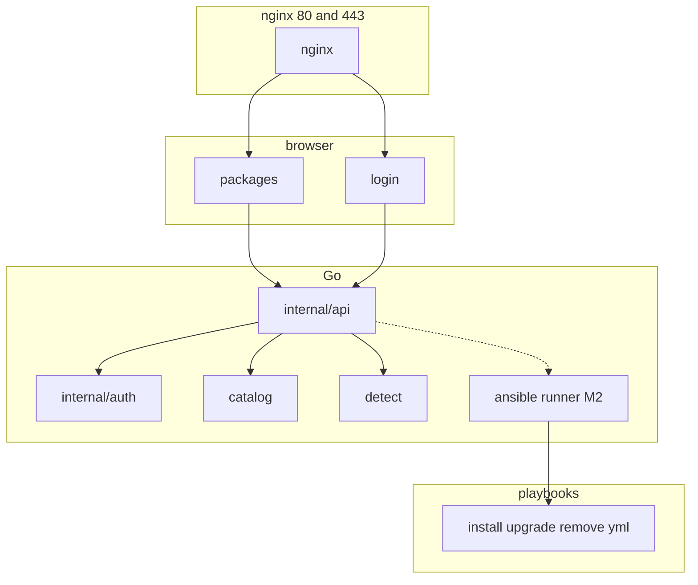

# brrewery — bootstrap plan

## Current state

Greenfield: [`AGENTS.md`](AGENTS.md) only. Reference projects: [qui](file:///home/martyluky/Documents/dev/qui), [swizzin](file:///home/martyluky/Documents/dev/swizzin).

## Constraints

From [`AGENTS.md`](AGENTS.md). MVP = **catalog + status** (~15–20 packages). Package **execution** (install/upgrade/remove) is **M2**.

| Area | Rule |
|------|------|
| Stack | Go + React (Vite, TS, Tailwind, TanStack); autobrr-style layout; **amd64 only** |
| Database | None (no SQLite/PostgreSQL) |
| Runtime | No `config.toml`, no env/flags on `brrewery serve`; fixed `internal/paths` |
| Host setup | `scripts/install.sh` → deps, binary, nginx, ansible, systemd |
| Logging | Fixed log file only in production |
| Public UI | nginx **:80** / **:443** at `/`; Go on **127.0.0.1:8080** only |
| Nginx | [nginxconfig.io](https://github.com/digitalocean/nginxconfig.io) layout; configs in `sites-available/`, enabled via **symlinks** in `sites-enabled/` |
| Install status | Filesystem probes only — no JSON/lock state files |
| Package ops | **Ansible playbooks** under `ansible/playbooks/packages/<id>/`; Go orchestrates `ansible-playbook` (M2) |
| Auth | In-app login; install-time admin via `create-admin`; session cookies; file store (hashes only) |
| Package secrets | Frontend extra-vars at install time — never persisted (separate from dashboard accounts) |
| Dev | `make dev` for local work only |

Domain code: `internal/packages/` (catalog, detect, ansible runner). Playbooks: repo `ansible/` → `/usr/share/brrewery/ansible`.

---

## Architecture



| Component | Role |
|-----------|------|
| `internal/packages/catalog` | Metadata, `DetectionSpec`, playbook paths |
| `internal/packages/detect` | `LookPath`, systemd, paths |
| `internal/packages/ansible` | Run playbooks, extra-vars, stream logs (M2) |
| `internal/auth` | Sessions, login, file-backed users |
| `web/src` | `/login`, `/packages` |

### Fixed paths

| Constant | Value |
|----------|-------|
| `BinaryPath` | `/usr/local/bin/brrewery` |
| `BackendListenAddress` | `127.0.0.1:8080` |
| `LogFile` | `/var/log/brrewery/brrewery.log` |
| `WebRoot` | `/var/www/brrewery` |
| `UserStorePath` | `/var/lib/brrewery/users.json` |
| `SessionSecretPath` | `/var/lib/brrewery/session.key` |
| `AnsibleRoot` | `/usr/share/brrewery/ansible` |
| `NginxSitesAvailable` | `/etc/nginx/sites-available` |
| `NginxSitesEnabled` | `/etc/nginx/sites-enabled` |
| TLS | `/etc/ssl/brrewery/fullchain.pem`, `privkey.pem` |

### Nginx

```text
contrib/nginx/  →  /etc/nginx/
  nginx.conf
  sites-available/brrewery.conf
  nginxconfig.io/{security,general,proxy,ssl}.conf

sites-enabled/brrewery.conf  →  ../sites-available/brrewery.conf
```

`install.sh`: deploy configs, `ln -sf` brrewery site, TLS, `nginx -t && reload`. Managed app vhosts: **Ansible role** `brrewery_nginx_site` (post-MVP playbooks).

Dashboard vhost: HTTP 80 + HTTPS 443; `/` → SPA; `/api/` → backend. No nginx `auth_basic`.

### Ansible

```text
ansible/
  ansible.cfg
  inventory/localhost.yml
  roles/brrewery_nginx_site/
  roles/common/
  playbooks/packages/<id>/{install,upgrade,remove}.yml
```

Go runner (M2): `ansible-playbook --connection=local` with extra-vars from API; re-probe filesystem after success.

MVP: layout + stub playbooks + `ansible-playbook --syntax-check` in CI.

### Catalog types

```go
type DetectionSpec struct {
    Binaries, SystemdUnits, Paths []string
    DependsOn                     []string
}

type Package struct {
    ID, Name, Description, Category string
    Dependencies                  []string
    Detection                     DetectionSpec
    Playbooks                     PlaybookPaths
}

type PlaybookPaths struct {
    Install, Upgrade, Remove string // under AnsibleRoot
}
```

---

## Phases (MVP)

### 0 — Scaffold

`go.mod`, Makefile, lint/CI, README, LICENSE, `.air.toml`, frontend toolchain (Vite/React/Tailwind/TanStack), embed `web/dist` → `internal/web/dist`.

### 1 — Backend

Commands: `serve` (no flags), `version`, `create-admin`.

API: `GET /health`; `POST /api/v1/auth/login|logout`; protected `GET /api/v1/version`, `GET /api/v1/packages`, `GET /api/v1/packages/{id}`. OpenAPI + `make test-openapi`.

### 2 — Packages

Catalog (~15–20), detect service, ansible playbook stubs per entry, tests.

### 3 — Frontend

Login form, route guards, packages table, Vitest.

### 4 — Auth

File user store (`tenant_id` reserved), bcrypt hashes, scs sessions, install script → `create-admin`.

### 5 — Install & docs

`scripts/install.sh`, `contrib/systemd/brrewery.service`, `contrib/nginx/`, `docs/nginx-sites.md`, `docs/ansible-packages.md`.

---

## Verification (MVP)

1. `make build`, `make test`, `make test-openapi`, `make precommit`
2. `make dev` — login → packages list
3. `sudo ./scripts/install.sh` — brrewery active; nginx symlink valid; login at `https://127.0.0.1`
4. Unauthenticated `/api/v1/packages` → 401; with session → 200
5. 8080 on 127.0.0.1 only; logs in `LogFile` only

---

## Later milestones

| # | Scope |
|---|--------|
| M2 | Ansible install/upgrade/remove API, log streaming, real playbooks, `brrewery_nginx_site` role |
| M3 | Install wizard UI — extra-vars (secrets in request only) |
| M4 | Optional swizzin path probes (read-only) |
| M5 | Multi-tenant users and roles |

---

## Implementation order

1. scaffold repo  
2. api shell (serve, paths, auth, embed)  
3. packages (catalog, detect, ansible stubs, API)  
4. frontend (login, packages)  
5. install script + nginx + systemd  
6. docs + AGENTS.md architecture fix  

---

## Decisions

| Topic | Choice |
|-------|--------|
| Package lifecycle | Ansible playbooks; Go orchestrates only |
| Install status | Filesystem probes, not playbook markers |
| Host setup | bash `install.sh` + ansible package |
| Template | qui build/embed; not qui DB/config |
