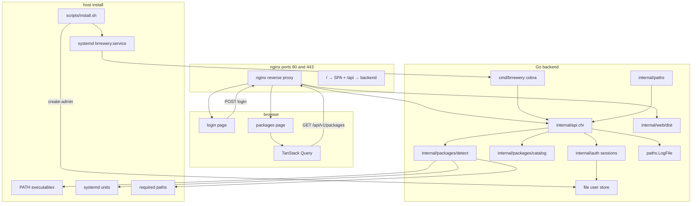

# brrewery — bootstrap plan

## Current state

The workspace contains only [`AGENTS.md`](AGENTS.md). No `go.mod`, `Makefile`, `web/`, or `internal/` exist yet. Local references [`qui`](file:///home/martyluky/Documents/dev/qui) and [`swizzin`](file:///home/martyluky/Documents/dev/swizzin) inform structure and domain.

## Constraints

Requirements from [`AGENTS.md`](AGENTS.md) and locked MVP scope—apply from day one, not as follow-up rules.

### Product

- **Purpose:** Web UI to access, install, manage, upgrade, and remove packages (swizzin successor, **amd64 only**).
- **Stack:** Go backend + React (Vite, TypeScript, Tailwind, TanStack); layout aligned with [autobrr](https://github.com/autobrr) org projects.
- **MVP scope:** Go-native **catalog + status** only (~15–20 packages); defer install/remove/update execution.
- **No database:** No SQLite or PostgreSQL.

### Configuration and runtime

- **No `config.toml`** and **no runtime env vars or CLI flags** on `brrewery serve`.
- **Fixed paths** in `internal/paths`, mirrored by `scripts/install.sh`, systemd, and nginx.
- **Setup:** `scripts/install.sh` installs dependencies, deploys binary + nginx + static assets, enables **systemd** autostart.
- **Logging:** Application logs **only** to a fixed log file (`paths.LogFile`), not stdout/stderr in production.

### Deployment and networking

- **Dashboard** always behind **nginx at `/`** (not served directly to users on 8080).
- **Public Web UI:** nginx on **port 80 (HTTP)** and **port 443 (HTTPS)**.
- **Backend upstream:** Go listens on **`127.0.0.1:8080`** only (`paths.BackendListenAddress`).
- **Nginx layout:** [nginxconfig.io](https://github.com/digitalocean/nginxconfig.io) modular structure (`nginx.conf`, `sites-available/`, `sites-enabled/` via **symlinks**, `nginxconfig.io/` snippets).
- **Site enablement:** Config files live in **`sites-available/`**; only **symlinks** in **`sites-enabled/`** activate them—never edit configs directly in `sites-enabled/`.

### Package install detection

- **No JSON or lock files** for brrewery install state (tamperable).
- **`installed` / `available`** from **filesystem probes** (binaries, systemd units, paths, catalog dependencies).
- **Package install logic:** Go-native (future); bash only for **host setup**, not per-app swizzin scripts.

### Authentication

- **Login UI:** Visiting `http://127.0.0.1` / `https://127.0.0.1` (and production hostnames on 80/443) shows an **in-app login form** before the dashboard.
- **Initial admin:** `scripts/install.sh` prompts for username + password of the operator running setup; stored as **password hash only** (e.g. bcrypt) via `brrewery create-admin` — this is the first account used to sign in.
- **Sessions:** App-level session cookies (e.g. `scs` like qui); nginx does **not** terminate auth (`auth_basic` not used for the dashboard).
- **No SQL DB:** Accounts live in a fixed-path file store (e.g. `/var/lib/brrewery/users.json`, mode `0600`) — hashes + usernames/roles only, never plaintext passwords.
- **Multi-tenant (post-MVP):** Data model and APIs should reserve `tenant_id` / roles so additional users can be added later; MVP ships **one owner user** from install only (no “add user” UI yet).
- **Package install secrets** (AGENTS.md security): passwords/tokens for *arr, etc. remain frontend-only at install time — separate from dashboard accounts.

### Security (package installs)

- Do not persist third-party service credentials from package wizards in files or DB; prompt on the frontend per install flow (future).

### Code layout

- Domain code under **`internal/packages/`** (catalog, detect, future installers)—not the `internal/services/` *arr list in AGENTS.md’s quick reference (update that doc when scaffolding).

### Development vs production

- **`make dev`:** local iteration only (Vite proxy, air)—not the documented operator install path.

---

## Target architecture (MVP)



| Layer | Responsibility |
|-------|----------------|
| `internal/packages/catalog` | Static registry: metadata + per-package `DetectionSpec` |
| `internal/packages/detect` | Live host probes (`LookPath`, `systemctl`, `os.Stat`) |
| `internal/auth` | Sessions, login/logout, password verify; file-backed user store |
| `internal/api` | HTTP + OpenAPI; auth middleware on `/api/v1/*` (except login/health) |
| `web/src` | `/login` form; protected packages UI; TanStack Query |
| `internal/web/dist` | Production bundle via `make frontend` |

### Fixed paths (`internal/paths`)

| Constant | Value | Used by |
|----------|-------|---------|
| `BinaryPath` | `/usr/local/bin/brrewery` | install script, systemd |
| `BackendListenAddress` | `127.0.0.1:8080` | Go listen, nginx `proxy_pass` (localhost only) |
| `PublicHTTPPort` | `80` | nginx HTTP |
| `PublicHTTPSPort` | `443` | nginx HTTPS |
| `LogFile` | `/var/log/brrewery/brrewery.log` | Go logger |
| `WebRoot` | `/var/www/brrewery` | nginx SPA `root` |
| `NginxSiteName` | `brrewery` | basename for `sites-available/brrewery.conf` |
| `NginxSitesAvailable` | `/etc/nginx/sites-available` | all vhost configs (source of truth) |
| `NginxSitesEnabled` | `/etc/nginx/sites-enabled` | symlinks only — nginx loads via `include sites-enabled/*` |
| `SSLCertificate` / `SSLCertificateKey` | `/etc/ssl/brrewery/fullchain.pem`, `privkey.pem` | nginx TLS |
| `UserStorePath` | `/var/lib/brrewery/users.json` | hashed dashboard accounts (`0600`) |
| `SessionSecretPath` | `/var/lib/brrewery/session.key` | session signing key (`0600`, created at install) |

Cross-reference these constants in the install script, nginx configs, and `create-admin`.

### Nginx ([nginxconfig.io](https://github.com/digitalocean/nginxconfig.io) layout)

Debian-style **available vs enabled** split (same model as nginxconfig.io “Modularized structure”):

| Directory | Role |
|-----------|------|
| `/etc/nginx/sites-available/` | Canonical vhost configs (brrewery + each managed app) |
| `/etc/nginx/sites-enabled/` | **Symlinks only** into `sites-available/` — toggles what nginx loads |
| `/etc/nginx/nginxconfig.io/` | Shared snippets (`proxy.conf`, `ssl.conf`, …) |

```text
contrib/nginx/                          → deployed to /etc/nginx/
  nginx.conf                            # include sites-enabled/*
  sites-available/
    brrewery.conf                       # dashboard: / + /api/ on 80/443
  nginxconfig.io/
    security.conf
    general.conf
    proxy.conf
    ssl.conf

/etc/nginx/sites-enabled/               # on disk after install (symlinks)
  brrewery.conf  →  ../sites-available/brrewery.conf
  sonarr.conf    →  ../sites-available/sonarr.conf   # example: post-MVP managed app
```

#### Enabling brrewery (install script)

`scripts/install.sh` must:

1. Copy `contrib/nginx/sites-available/brrewery.conf` → `/etc/nginx/sites-available/brrewery.conf`
2. Enable the site (idempotent):

```bash
ln -sf /etc/nginx/sites-available/brrewery.conf \
       /etc/nginx/sites-enabled/brrewery.conf
```

3. Run `nginx -t` before reload — fail install if the symlink or config is invalid.

To **disable** brrewery without deleting config: remove the symlink only (`rm /etc/nginx/sites-enabled/brrewery.conf`), then reload nginx.

#### Managed applications (install/remove lifecycle — post-MVP, design now)

When brrewery installs a package that exposes a web UI (Sonarr, Radarr, qBittorrent, etc.), Go installers (not bash) should:

1. Write `/etc/nginx/sites-available/<package-id>.conf` (from templates in repo, e.g. `internal/packages/nginx/templates/sonarr.conf.tmpl`).
2. **Enable** by symlinking:

```bash
ln -sf /etc/nginx/sites-available/<package-id>.conf \
       /etc/nginx/sites-enabled/<package-id>.conf
```

3. **`nginx -t && systemctl reload nginx`** after enable/disable.
4. On **remove**: delete the `sites-enabled` symlink first, then remove `sites-available/<package-id>.conf` (or archive), reload nginx.
5. **Detection:** optional probe that `sites-enabled/<package-id>.conf` exists and resolves (supplements binary/systemd checks).

Implement symlink helpers in **`internal/nginx/site.go`** (e.g. `EnableSite(name)`, `DisableSite(name)`) so install/remove paths share one code path; unit tests use temp dirs.

**MVP:** only brrewery’s own symlink is created by `install.sh`; catalog packages do not get vhosts until M2 install flows exist. Document the convention in `docs/nginx-sites.md`.

**`sites-available/brrewery.conf`:** HTTP **80** + HTTPS **443**; proxy `/api/` to backend; serve SPA from `WebRoot` with `try_files`. **No nginx `auth_basic`** — authentication is in brrewery.

**Install (`scripts/install.sh`):** amd64 → deps → binary → static assets → deploy nginx tree → **symlink brrewery site** → TLS for 443 → **prompt initial admin** → `brrewery create-admin` → systemd enable → `nginx -t && reload`.

### Install detection

```go
type DetectionSpec struct {
    Binaries     []string
    SystemdUnits []string
    Paths        []string
    DependsOn    []string // other catalog IDs
}
```

`installed` = all conditions pass; never write brrewery-owned marker files.

---

## Phase 0 — Repository foundation

| Deliverable | Details |
|-------------|---------|
| `go.mod` | `github.com/autobrr/brrewery`, Go 1.26+ |
| `Makefile` | `build`, `dev`, `test`, `lint`, `precommit`, `test-openapi`, … per AGENTS.md |
| `.golangci.yml` | Adapt from qui |
| `.github/workflows/` | `test.yml`, `lint.yml` |
| `README.md` | Purpose, amd64, `scripts/install.sh`, `make dev` |
| `LICENSE` | GPL-2.0-or-later |
| `.air.toml` | Hot-reload for backend dev |

Frontend: Vite + React 19 + TS + Tailwind v4 + TanStack (minimal deps). Embed: `web/dist` → `internal/web/dist` (qui pattern).

---

## Phase 1 — Backend skeleton

| Command | Behavior |
|---------|----------|
| `serve` | No flags; load user store + session secret from fixed paths; graceful shutdown |
| `version` | Build metadata to stderr |
| `create-admin` | Create or replace bootstrap admin (username + password from install script); password hashed before write |

Omit: `generate-config`, flag parsing on `serve`.

```go
// internal/paths/paths.go
const (
    BinaryPath           = "/usr/local/bin/brrewery"
    BackendListenAddress = "127.0.0.1:8080"
    PublicHTTPPort       = 80
    PublicHTTPSPort      = 443
    LogFile              = "/var/log/brrewery/brrewery.log"
    WebRoot              = "/var/www/brrewery"
    UserStorePath        = "/var/lib/brrewery/users.json"
    SessionSecretPath    = "/var/lib/brrewery/session.key"
    NginxSitesAvailable  = "/etc/nginx/sites-available"
    NginxSitesEnabled    = "/etc/nginx/sites-enabled"
)
```

- `internal/api`: chi, file logging; public: `GET /health`, `POST /api/v1/auth/login`, `POST /api/v1/auth/logout`; protected: `GET /api/v1/version`, `GET /api/v1/packages`, …
- `internal/web/swagger/openapi.yaml` + `make test-openapi`
- `internal/metrics`: stub

---

## Phase 2 — Package domain

- Catalog: ~15–20 entries with realistic `DetectionSpec` (qbittorrent, sonarr, radarr, …).
- `internal/packages/detect`: injectable probes for tests.
- `Service.List` / `Get` → `PackageWithStatus` with `installed` | `available`.
- Future: `Installer` interface in `internal/packages/installers/` (not MVP); installers call `internal/nginx` to symlink app vhosts on install/remove.

---

## Phase 3 — Frontend

- **`/login`:** username + password form; `POST /api/v1/auth/login`; on success navigate to `/packages`.
- **Route guards:** unauthenticated users hitting `/` or `/packages` redirect to `/login`.
- **`/packages`:** catalog table (MVP main view).
- Relative `/api/v1/...`; Vitest for login form + `package-table`. Vite proxies `/api` in dev.

---

## Phase 4 — Auth (MVP + multi-tenant groundwork)

### MVP

- `internal/auth`: verify credentials against file store; issue session cookie (`HttpOnly`, `Secure` when on HTTPS).
- `internal/models` (or `internal/auth/store`): `User` with `id`, `username`, `password_hash`, `role`, `tenant_id` (default `"default"` for sole install user).
- Install script collects credentials interactively; runs `brrewery create-admin --username …` (password via stdin/env only during command, never written plaintext to disk).
- First login at `https://127.0.0.1` uses the install-time account.

### Post-MVP (design now, implement later)

- Admin APIs/UI to **add/remove users** per tenant.
- Role-based access (owner, member, …) when multi-tenant lands.
- Keep store format versioned JSON or migrate to embedded store only if needed — still **no PostgreSQL/SQLite** unless AGENTS.md changes.

---

## Phase 5 — Install, systemd, docs

- `scripts/install.sh` — full production setup (see Constraints).
- `contrib/systemd/brrewery.service` — `ExecStart=/usr/local/bin/brrewery serve`, no `Environment=`.
- `contrib/nginx/` — installed by script; **brrewery** site enabled via symlink.
- `docs/nginx-sites.md` — `sites-available` / `sites-enabled` convention for brrewery and managed apps.
- `docs/` — paths, install flow, detection rules.
- `Dockerfile` — optional, CI/dev only.

---

## Verification (MVP)

1. `make build`, `make test`, `make test-openapi`, `make precommit`
2. `make dev` — login then packages list
3. `sudo ./scripts/install.sh` — admin password; `systemctl is-active brrewery`; `readlink -f /etc/nginx/sites-enabled/brrewery.conf` points at `sites-available/brrewery.conf`
4. Browser: `https://127.0.0.1` → login form → dashboard after install credentials
5. `curl` without session → `401` on `/api/v1/packages`; with session cookie → `200`
6. **8080** bound to 127.0.0.1 only
7. Logs only in `paths.LogFile`; `UserStorePath` contains hashes only (`grep` shows no plaintext password)
8. Filesystem probe: binary present → `installed` without package state files

---

## Out of scope (later)

| Milestone | Contents |
|-----------|----------|
| M2 | Install/remove + progress streaming + **nginx site symlink** per app |
| M3 | Upgrade API |
| M4 | Install wizard secrets (memory only) |
| M5 | Optional swizzin path probes (read-only) |
| M6 | Multi-tenant: add users, roles, tenant isolation |

---

## Implementation order

1. **chore:** scaffold repo  
2. **feat(api):** serve + paths + logfile + embed shell  
3. **feat(packages):** catalog + detect + API + OpenAPI  
4. **feat(auth):** file user store, sessions, login API, `create-admin`  
5. **feat(web):** login + packages pages + tests  
6. **feat(install):** `install.sh` + admin bootstrap + systemd + nginx  
7. **chore:** docs + fix AGENTS.md architecture section  

---

## Decision log

| Topic | Decision |
|-------|----------|
| Production install | `scripts/install.sh` only |
| Runtime config | Fixed `internal/paths`; no flags/env |
| Public ports | nginx **80** / **443**; backend **127.0.0.1:8080** |
| Nginx | nginxconfig.io layout; **sites-available** = configs, **sites-enabled** = symlinks; brrewery + managed apps |
| Install status | Filesystem probes only |
| Logging | Fixed log file path |
| Auth | In-app login; install-time admin; file store (hashes); sessions; multi-tenant later (M6) |
| AGENTS.md “no user info in files” | Applies to **package/service secrets**, not dashboard password hashes |
| Package installers | Go-native (post-MVP) |
| Template | qui build/embed patterns; not qui DB/config |
